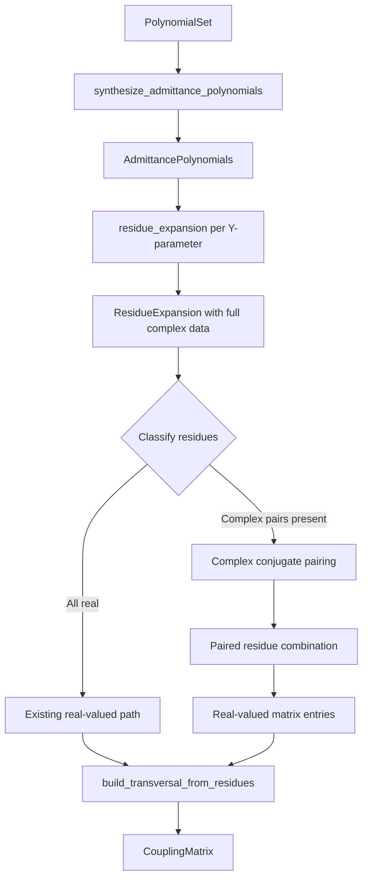

# Design Document: Synthesis Numerical Fix

## Overview

This design addresses the numerical failure in the MFS residue expansion algorithm where `real_part_if_almost_real` rejects residues with non-negligible imaginary parts. The fix extends the synthesis path to handle complex-conjugate residue pairs that legitimately arise for certain filter configurations (order 3 with 2 transmission zeros, all-pole filters of order 2 and 3).

The core insight is that for these configurations, the Y-parameter residues at conjugate poles are themselves complex conjugates. When properly paired and combined, they produce real-valued coupling matrix entries. The current code incorrectly assumes all residues are individually real, which is only true for a subset of filter configurations.

### Design Rationale

The fix follows a **minimal-invasive extension** strategy:
- The existing real-residue path remains unchanged for backward compatibility
- A new complex-residue pairing step is inserted between residue computation and matrix construction
- The transversal builder gains a second code path for complex pairs that reduces to the existing path when residues happen to be real

This approach was chosen over alternatives (e.g., always working in complex arithmetic) because:
1. It preserves exact numerical equivalence for currently-working configurations
2. It keeps the common case (real residues) fast and simple
3. It isolates the new logic for easier testing and debugging

## Architecture



The change is localized to `src/synthesis/residues.rs` with the following structural additions:

1. **Residue classification** — After computing residues, classify each as real or complex
2. **Conjugate pairing** — Match complex residues with their conjugate partners
3. **Real extraction from pairs** — Combine conjugate pairs to produce real coupling values
4. **Fallback to existing path** — When all residues are real, use the unchanged current logic

## Components and Interfaces

### Modified Components

#### `ResidueExpansion` (existing struct, unchanged interface)

The `ResidueExpansion` struct retains its current fields. The residues already store full `ComplexCoefficient` values — the issue is downstream in `build_transversal_from_residues` where `real_part_if_almost_real` discards data.

#### `build_transversal_from_residues` (modified function)

```rust
pub(crate) fn build_transversal_from_residues(
    polynomials: &PolynomialSet,
    y11: &ResidueExpansion,
    y12: &ResidueExpansion,
    y22: &ResidueExpansion,
) -> Result<CouplingMatrix>
```

**Changes:**
- Remove the `real_part_if_almost_real` guard that causes the failure
- Add residue classification step before matrix entry computation
- Route real residues through the existing extraction logic
- Route complex-conjugate pairs through a new combination function

### New Internal Components

#### `ResidueClassification` (new enum)

```rust
/// Classification of a residue for matrix construction purposes.
enum ResidueClassification {
    /// Residue is real-valued (imaginary magnitude below threshold).
    Real { index: usize },
    /// Residue is part of a complex-conjugate pair.
    ComplexPair { index_a: usize, index_b: usize },
}
```

#### `classify_residues` (new function)

```rust
/// Classifies residues as real or complex-conjugate pairs.
fn classify_residues(
    y11: &ResidueExpansion,
    y12: &ResidueExpansion,
    y22: &ResidueExpansion,
    tolerance: f64,
) -> Result<Vec<ResidueClassification>>
```

**Logic:**
1. Iterate through residues sorted by pole imaginary part
2. For each residue with `|im| > tolerance`, search for a conjugate pole match
3. Verify that residues at conjugate poles are themselves conjugates
4. Return error if an unpaired complex residue is found

#### `combine_conjugate_pair` (new function)

```rust
/// Combines a complex-conjugate residue pair into real matrix entries.
fn combine_conjugate_pair(
    pole_a: ComplexCoefficient,
    residue_11_a: ComplexCoefficient,
    residue_12_a: ComplexCoefficient,
    residue_22_a: ComplexCoefficient,
) -> Result<(f64, f64, f64, f64)>  // (diagonal, source_coupling, load_coupling, cross_coupling)
```

**Mathematical basis:**
For a conjugate pair at poles `p` and `p*` with residues `r` and `r*`:
- The diagonal entry is `-Im(p)` (pole location on imaginary axis)
- Source coupling: `sqrt(2 * Re(r11))` (real part of the residue sum)
- Load coupling: derived from `r12 / sqrt(r11)` or `sqrt(r22)` depending on magnitudes
- The combination `r/(s-p) + r*/(s-p*)` produces a real-valued rational function

### Interface Contracts

| Function | Input | Output | Invariant |
|----------|-------|--------|-----------|
| `classify_residues` | Three `ResidueExpansion` | `Vec<ResidueClassification>` | Every residue index appears exactly once |
| `combine_conjugate_pair` | Complex pole + 3 complex residues | 4 real values | All outputs are finite real numbers |
| `build_transversal_from_residues` | `PolynomialSet` + 3 expansions | `CouplingMatrix` | All matrix entries are real; dimensions = (order+2)² |

## Data Models

### Existing Data Models (unchanged)

```rust
pub struct ResiduePole {
    pub pole: ComplexCoefficient,      // Pole location in s-plane
    pub residue: ComplexCoefficient,   // Residue at that pole
}

pub struct ResidueExpansion {
    pub residues: Vec<ResiduePole>,           // Sorted by pole imaginary part
    pub constant_term: Option<ComplexCoefficient>,
}

pub struct AdmittancePolynomials {
    pub denominator: ComplexPolynomial,
    pub y11: ComplexPolynomial,
    pub y12: ComplexPolynomial,
    pub y22: ComplexPolynomial,
}
```

### New Internal Data Model

```rust
/// Intermediate representation of classified residues for matrix construction.
struct ClassifiedResidues {
    /// Indices of residues that are real-valued (process individually).
    real_indices: Vec<usize>,
    /// Pairs of indices representing complex-conjugate residue pairs.
    conjugate_pairs: Vec<(usize, usize)>,
}
```

### Key Numerical Thresholds

| Threshold | Value | Purpose |
|-----------|-------|---------|
| Complex residue detection | `1e-6` | Distinguish real from complex residues |
| Conjugate pole matching | `1e-8` | Match poles as conjugates |
| Matrix entry realness | `1e-10` | Final validation of real-valued output |
| Root solver convergence | `1e-12` | Durand-Kerner iteration termination |
| Small value cleanup | `1e-10` | Zero out negligible matrix entries |

## Correctness Properties

*A property is a characteristic or behavior that should hold true across all valid executions of a system — essentially, a formal statement about what the system should do. Properties serve as the bridge between human-readable specifications and machine-verifiable correctness guarantees.*

### Property 1: Complex conjugate residues are correctly paired

*For any* valid `PolynomialSet` that produces complex residues (imaginary magnitude > 1e-6), the residue classification step SHALL pair every complex residue with exactly one conjugate partner, such that the paired poles satisfy `|Im(p_a) + Im(p_b)| < 1e-8` and `|Re(p_a) - Re(p_b)| < 1e-8`.

**Validates: Requirements 1.1, 1.2**

### Property 2: Residue data preservation through the pipeline

*For any* valid `PolynomialSet`, the `ResidueExpansion` output SHALL contain residues whose complex values, when used to reconstruct the original rational function via `sum(residue_k / (s - pole_k)) + constant`, match the original Y-parameter numerator/denominator ratio within tolerance 1e-8 at 10 randomly sampled points on the imaginary axis.

**Validates: Requirements 1.3, 8.3**

### Property 3: Transversal matrix entries are real-valued

*For any* valid `PolynomialSet` with order 2–8 and 0 to (order-1) finite transmission zeros, the `build_transversal_from_residues` function SHALL produce a `CouplingMatrix` where every entry has zero imaginary component (the matrix is stored as `Vec<f64>`).

**Validates: Requirements 2.1, 2.2**

### Property 4: Matrix structural invariants

*For any* valid `PolynomialSet` with order N (2 ≤ N ≤ 8), the synthesized `CouplingMatrix` SHALL have dimension (N+2) × (N+2), and the source-to-resonator couplings at positions (0, 1..=N) and resonator-to-load couplings at positions (1..=N, N+1) SHALL each have at least one non-zero value with magnitude > 1e-12.

**Validates: Requirements 2.4, 4.2**

### Property 5: Synthesis succeeds for all valid filter configurations

*For any* valid `FilterSpec` with order N (2 ≤ N ≤ 8), return loss 15–25 dB, and 0 to (N-1) finite transmission zeros with magnitudes in [1.1, 3.0], the `MatrixSynthesisEngine::synthesize` function SHALL return `Ok(CouplingMatrix)` without a `NumericalFailure` error.

**Validates: Requirements 3.1, 4.1**

### Property 6: Topology transformation succeeds on synthesized matrices

*For any* valid `PolynomialSet` with order 3–8 and at least one finite transmission zero, the synthesized `CouplingMatrix` SHALL be successfully transformable to `MatrixTopology::Folded` without error.

**Validates: Requirements 4.3**

### Property 7: Root solver accuracy

*For any* denominator polynomial arising from `synthesize_admittance_polynomials` applied to a valid `PolynomialSet` with order 2–8, every root `r` found by `DurandKernerRootSolver` SHALL satisfy `|P(r)| / |leading_coefficient(P)| < 1e-8`.

**Validates: Requirements 6.1, 6.3**

### Property 8: Backward compatibility for real-residue configurations

*For any* `PolynomialSet` with order ≥ 4 and 1 to (order-2) finite transmission zeros (configurations that produce real residues in the current implementation), the fixed synthesis path SHALL produce a `CouplingMatrix` numerically identical (within 1e-10 per entry) to the matrix produced by the current implementation.

**Validates: Requirements 7.1, 7.2, 7.3**

### Property 9: Admittance polynomial degree constraints

*For any* valid `PolynomialSet` with order N and K finite transmission zeros, the `synthesize_admittance_polynomials` function SHALL produce polynomials satisfying: `degree(denominator) == N` and `degree(y12) <= K`.

**Validates: Requirements 8.1, 8.2**

### Property 10: Admittance polynomial coefficient parity

*For any* valid `PolynomialSet` where E(s) has purely imaginary coefficients on odd powers and purely real coefficients on even powers, the admittance denominator polynomial SHALL preserve this parity structure: purely imaginary coefficients on odd powers and purely real coefficients on even powers.

**Validates: Requirements 8.4**

## Error Handling

### Error Scenarios

| Scenario | Error Type | Message Pattern | Recovery |
|----------|-----------|-----------------|----------|
| Unpaired complex residue | `MfsError::NumericalFailure` | "unpaired complex residue at pole {pole}: no conjugate match found" | None — indicates invalid polynomial input |
| Root solver non-convergence | `MfsError::NumericalFailure` | "complex polynomial root solver did not converge" | None — existing behavior preserved |
| Pole too far from imaginary axis | `MfsError::NumericalFailure` | "transversal synthesis currently expects poles close to the imaginary axis" | None — existing check preserved |
| Combined pair produces non-real entry | `MfsError::NumericalFailure` | "conjugate pair combination produced non-real coupling (residual: {value})" | None — indicates numerical instability |
| Missing generalized data | `MfsError::PreconditionViolation` | "residue expansion requires generalized Chebyshev data" | Caller must provide generalized polynomial data |

### Error Propagation Strategy

- All errors propagate via `Result<T>` using the `?` operator
- No panics in the synthesis path — all failures are recoverable `MfsError` variants
- The new complex-pair path adds at most two new `NumericalFailure` variants (unpaired residue, non-real combination result)
- Existing error messages and codes are unchanged for backward compatibility

### Tolerance Hierarchy

The design uses a strict hierarchy of numerical tolerances:
1. **Root solver convergence** (1e-12): Tightest, ensures high-quality roots
2. **Conjugate pole matching** (1e-8): Moderate, allows for root-solver imprecision
3. **Complex residue detection** (1e-6): Loosest for classification, matches current `real_part_if_almost_real` threshold
4. **Final matrix validation** (1e-10): Tight check on output quality

## Testing Strategy

### Property-Based Testing

This feature is well-suited for property-based testing because:
- The core algorithms are pure functions with clear input/output behavior
- Universal properties (real-valued output, degree constraints, round-trips) hold across a wide input space
- The input space (filter orders, return loss values, transmission zero placements) is large
- Edge cases (near-degenerate configurations) are best found through randomized exploration

**Library:** [proptest](https://crates.io/crates/proptest) — the standard Rust PBT library

**Configuration:**
- Minimum 100 iterations per property test
- Each property test tagged with: `// Feature: synthesis-numerical-fix, Property {N}: {title}`

### Test Categories

#### Property-Based Tests (10 properties)

Each correctness property above maps to one `proptest` test function. Generators will produce:
- Random `FilterSpec` values: order 2–8, return loss 15–25 dB
- Random transmission zero placements: 0 to (order-1) zeros, magnitudes in [1.1, 3.0]
- The `generalized_chebyshev_polynomials` function converts specs to `PolynomialSet`

#### Example-Based Unit Tests

- Order-2 all-pole 20 dB: verify symmetric source/load couplings (Req 3.2)
- Order-3 all-pole 20 dB: verify zero diagonal entries (Req 3.3)
- Order-4 with 2 TZs at ±1.5: regression test against captured reference values (Req 7.1)
- Real-residue path selection: verify existing path is used when residues are real (Req 2.3)
- Sign convention preservation: verify coupling signs match current implementation (Req 7.3)

#### Integration Tests

- Previously-failing 11 configurations: full pipeline through bandpass scaling (Req 5.1)
- External Q extraction on previously-failing configs (Req 5.2)
- Triplet/trisection extraction on configs with TZs (Req 5.3)

#### Edge Case Tests

- Unpaired complex residue error (Req 1.4)
- Root solver non-convergence error message format (Req 6.2)

### Test Organization

```
src/synthesis/residues.rs          — unit tests in #[cfg(test)] mod
tests/synthesis_properties.rs      — property-based tests (proptest)
tests/synthesis_regression.rs      — regression tests for the 11 failing cases
```
