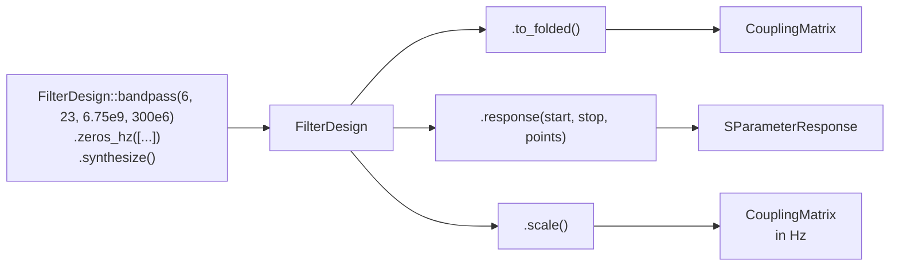
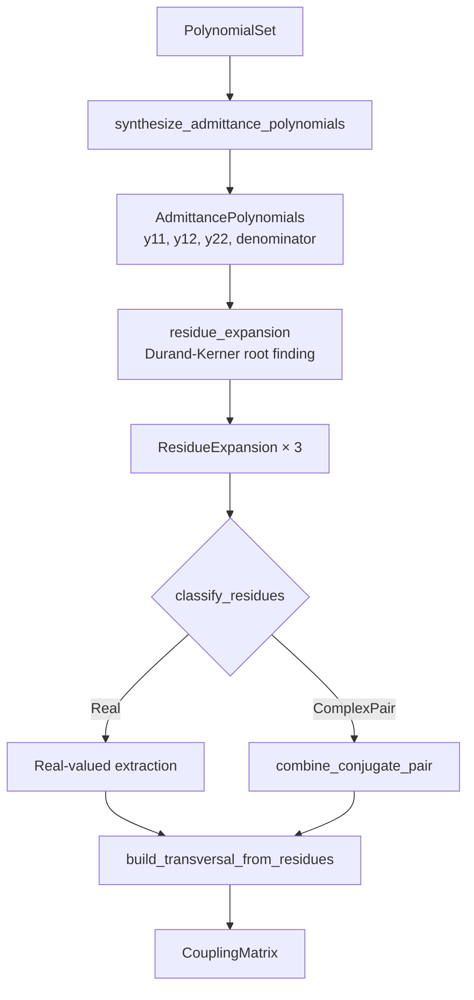

# MFS Rust Library Architecture

## Overview

`mfs` is a microwave filter synthesis library in Rust. It implements the complete
Cameron generalized Chebyshev coupling matrix synthesis pipeline:

```
FilterSpec → Approximation → Coupling Matrix → Topology Transform → S-Parameter Response
```

The library provides both a programmatic Rust API and a JSON-driven CLI for
automated filter design workflows. All numerical algorithms are fully implemented
and tested — the library is production-ready for generalized Chebyshev filter
synthesis with finite transmission zeros.

## Design Principles

- **Immutable value objects** — Specifications, polynomial sets, and coupling matrices
  are immutable once constructed. Each pipeline stage produces new data rather than
  mutating shared state.
- **Explicit types over implicit state** — Domain concepts (poles, residues,
  topologies, frequency mappings) are encoded in the type system.
- **Structured errors** — All failures are typed `MfsError` variants with descriptive
  messages. No panics in the synthesis path.
- **Layered architecture** — Mathematical synthesis, frequency mapping, and response
  evaluation are independent modules with typed boundaries.
- **Property-based testing** — Core algorithms are validated with 10 formal correctness
  properties using `proptest`, covering the full input space.

## Module Structure

```
src/
├── lib.rs              Crate root: re-exports and legacy compatibility
├── design.rs           High-level FilterDesign API (primary entry point)
├── prelude.rs          Minimal re-exports for common workflows
├── error.rs            Structured error enum (MfsError) and Result alias
├── freq.rs             Frequency mappings (LowPass, BandPass) and grid generation
├── approx/             Polynomial approximation
│   ├── mod.rs              Module facade
│   ├── polynomial.rs       PolynomialSet and GeneralizedChebyshevData types
│   ├── complex_poly.rs     ComplexPolynomial with arithmetic, roots, evaluation
│   ├── generalized_chebyshev.rs        Main approximation entry point
│   ├── generalized_chebyshev_helpers.rs  E(s), F(s), P(s) construction
│   └── generalized_ops.rs             Recursive Chebyshev operations
├── spec/               Filter specification types
│   ├── mod.rs              Module facade
│   ├── types.rs            FilterSpec, TransmissionZero
│   └── builder.rs          FilterSpecBuilder with validation
├── matrix/             Coupling matrix representation and operations
│   ├── mod.rs              Module facade and re-exports
│   ├── core.rs             CouplingMatrix struct, topology, shape, accessors
│   ├── builder.rs          CouplingMatrixBuilder with dimension validation
│   ├── rotations.rs        Givens rotations, diagonal rotation angles
│   ├── sections.rs         Triplet, quadruplet, trisection extraction
│   └── scaling.rs          Bandpass denormalization, external Q extraction
├── synthesis/          Coupling matrix synthesis engine
│   ├── mod.rs              Module facade and public exports
│   ├── engine.rs           MatrixSynthesisEngine orchestration
│   ├── residues.rs         Residue expansion, classification, transversal builder
│   ├── orchestration.rs    High-level synthesis + evaluation helpers
│   └── sections.rs         SectionSynthesis (triplet/quadruplet/trisection)
├── transform/          Topology transformations
│   ├── mod.rs              Transform facade, response invariance checking
│   ├── folded.rs           Transversal → Folded (Givens rotation sequence)
│   ├── arrow.rs            Transversal → Arrow (first-row reduction)
│   ├── wheel.rs            Wheel topology (deprecated, Arrow alias)
│   └── sections.rs         Section extraction with response verification
├── response/           S-parameter response evaluation
│   ├── mod.rs              ResponseSolver facade
│   ├── backend.rs          LU-based complex matrix solver
│   └── pole_expansion.rs   Fast pole-expansion solver (O(N) per point)
├── verify/             Verification and comparison utilities
│   └── mod.rs              Response comparison, topology pattern matching
├── pipeline/           JSON-driven pipeline orchestration
│   ├── mod.rs              Module facade
│   ├── context.rs          SynthesisContext, PipelineOptions, PipelineMetadata
│   ├── stages.rs           Stage trait + 4 concrete stages
│   ├── request.rs          SynthesisRequest parsing, run_full_pipeline
│   ├── execution.rs        Incremental execution, context persistence
│   └── schema.rs           JSON Schema generation
├── output/             Report rendering
│   ├── mod.rs              Module facade
│   ├── format.rs           Number formatting utilities
│   ├── terminal.rs         Terminal table rendering
│   ├── markdown.rs         Markdown report generation
│   └── report.rs           Report data structures
├── fixtures/           Literature-backed test fixtures
│   ├── mod.rs              Fixture loading
│   └── database.rs         Filter database JSON parsing
└── bin/
    └── mfs_cli.rs      CLI binary (--input, --stage, --resume, --format)
```

## Data Flow

### User-Facing API (FilterDesign)



### Internal Pipeline


### Response Evaluation (Two Paths)

```mermaid
flowchart TD
    A[CouplingMatrix] --> B{Pole Expansion<br/>from matrix}
    B -->|Success + verified| C[Fast O(N) response]
    B -->|Fallback| D[LU solver O(N³)]
    C --> E[SParameterResponse]
    D --> E
```

### Synthesis Engine Detail



## Module Responsibilities

### `spec` — Filter Specification

Captures engineering intent with validation at construction time.

**Key types:**
- `FilterSpec` — order, return loss, transmission zeros, unloaded Q
- `TransmissionZero` — finite (normalized value) or infinite
- `FilterSpecBuilder` — fluent builder with field-level validation

**Invariants enforced:**
- Order ≥ 1
- Return loss > 0 dB
- Transmission zero magnitudes ≥ 1.0 (or infinite)

### `freq` — Frequency Mapping

Separates physical frequency handling from normalized prototype math.

**Key types:**
- `FrequencyMapping` trait — `map_hz_to_normalized`, `map_normalized_to_hz`
- `LowPassMapping` — single cutoff frequency
- `BandPassMapping` — center frequency + bandwidth
- `FrequencyGrid` — uniform or custom frequency point sets

### `approx` — Polynomial Approximation

Implements the generalized Chebyshev approximation algorithm.

**Key types:**
- `PolynomialSet` — E(s), F(s), P(s) polynomials with metadata (eps, eps_r, order)
- `ComplexPolynomial` — complex-coefficient polynomial with arithmetic, evaluation, root finding
- `DurandKernerRootSolver` — iterative complex root finder (128 iterations, 1e-12 tolerance)
- `GeneralizedChebyshevData` — helper polynomials (E_s, F_s, P_s) for synthesis

**Algorithm:**
Recursive Chebyshev function generation with transmission zero injection,
producing the characteristic polynomials needed for coupling matrix synthesis.

### `matrix` — Coupling Matrix

Dense (N+2)×(N+2) real-valued coupling matrix with source and load nodes.

**Key types:**
- `CouplingMatrix` — immutable matrix with topology metadata
- `CouplingMatrixBuilder` — symmetric entry setting with bounds checking
- `MatrixTopology` — Transversal, Folded, Arrow, Wheel (deprecated)
- `BandPassScaledCouplingMatrix` — physical-frequency scaled matrix with external Q

**Operations:**
- Givens rotations (arbitrary axis pairs)
- Bandpass denormalization and normalization
- External Q extraction
- Section extraction (triplet, quadruplet, trisection)
- nalgebra-backed matrix multiply and transpose

### `synthesis` — Matrix Synthesis Engine

Orchestrates the conversion from polynomials to coupling matrix.

**Key types:**
- `MatrixSynthesisEngine` — main synthesis entry point
- `ResidueExpansion` — partial-fraction decomposition result
- `ResidueClassification` — Real or ComplexPair classification
- `AdmittancePolynomials` — y11, y12, y22 numerators + shared denominator
- `SectionSynthesis` — triplet/quadruplet/trisection synthesis workflows

**Algorithm:**
1. Construct admittance polynomials from E, F, P (with leading-coefficient normalization)
2. Find denominator roots via Durand-Kerner
3. Compute residues at each pole for y11, y12, y22
4. Classify residues as real or complex-conjugate pairs
5. Build transversal coupling matrix from classified residues
6. Optionally transform to target topology

### `transform` — Topology Transformations

Converts transversal matrices to physically realizable topologies.

**Key types:**
- `TopologyKind` — target topology enum
- `TransformOutcome` — transformed matrix + verification report
- `SectionTransformOutcome` — section extraction result with verification

**Supported topologies:**
- **Folded** — sequential coupling with cross-couplings (Givens rotation sequence)
- **Arrow** — first-row reduction form
- **Wheel** — deprecated, currently Arrow alias

**Features:**
- Response invariance verification (S-parameter comparison before/after)
- Topology pattern matching (structural sparsity validation)
- Section extraction with response checking

### `response` — S-Parameter Evaluation

Evaluates electrical response from coupling matrix over frequency grid.

**Key types:**
- `ResponseSolver` — configurable solver (lossless/lossy)
- `SParameterResponse` — collection of frequency-indexed S-parameter samples
- `ResponseSample` — S11, S21 (real + imaginary) at one frequency point

**Algorithm:**
Complex matrix inversion method: `[S] = [I] - 2j[R]^(1/2) ([jΩ] - [M])^(-1) [R]^(1/2)`

### `verify` — Verification Utilities

Provides comparison and pattern-matching tools for validation.

**Key types:**
- `ResponseTolerance` — configurable S-parameter comparison thresholds
- `ResponseCheckReport` — pass/fail with deviation metrics
- `MatrixPatternTolerance` — structural zero detection threshold

**Capabilities:**
- Response comparison (max deviation, RMS error)
- Topology pattern verification (folded, arrow sparsity patterns)
- Matrix symmetry checking

### `pipeline` — JSON-Driven Orchestration

Composable stage-based pipeline with JSON I/O and incremental execution.

**Key types:**
- `Stage` trait — `fn execute(&self, context: &mut SynthesisContext) -> Result<()>`
- `SynthesisContext` — accumulates artifacts across stages
- `SynthesisRequest` — JSON-parseable input specification
- `PipelineMetadata` — execution timing, warnings, version info

**Concrete stages:**
1. `ApproximationStage` — FilterSpec → PolynomialSet
2. `MatrixSynthesisStage` — PolynomialSet → CouplingMatrix
3. `TopologyTransformStage` — CouplingMatrix → TransformOutcome
4. `ResponseEvaluationStage` — CouplingMatrix + Grid → SParameterResponse

**Features:**
- `run_full_pipeline(request)` — complete execution from JSON
- `run_stage(context, stage_name)` — incremental single-stage execution
- `save_context` / `load_context` — file-based persistence for resume
- `describe_schema()` — JSON Schema for input/output formats

### `output` — Report Rendering

Terminal and markdown report generation for synthesis results.

### `fixtures` — Test Fixtures

Literature-backed reference filter configurations loaded from JSON database.

## CLI Interface

```
mfs_cli [OPTIONS]

Options:
  --input <FILE>     Read JSON request from file (default: stdin)
  --format <FORMAT>  Output format: json (default) or table
  --stage <NAME>     Execute only the named stage
  --resume <FILE>    Resume from a saved context file
```

## Error Model

```rust
pub enum MfsError {
    InvalidOrder { order: usize },
    InvalidReturnLoss { return_loss_db: f64 },
    InvalidFrequency(String),
    InvalidGridSize { points: usize },
    InvalidTransmissionZero(String),
    DimensionMismatch { expected: usize, actual: usize },
    NumericalFailure(String),
    NotImplemented(String),
    PreconditionViolation(String),
}
```

All errors are `Serialize + Deserialize` for structured JSON error reporting.

## Numerical Thresholds

| Threshold | Value | Purpose |
|-----------|-------|---------|
| Root solver convergence | 1e-12 | Durand-Kerner iteration termination |
| Conjugate pole matching | 1e-8 | Match poles as conjugate pairs |
| Complex residue detection | 1e-6 | Distinguish real from complex residues |
| Pole real threshold | 1e-10 | Classify poles as essentially real |
| Matrix entry realness | 1e-10 | Final validation of real-valued output |
| Structural zero | 1e-6 | Topology pattern verification |
| Leading coefficient cancellation | 1e-20 | Denominator normalization trigger |

## Testing Strategy

### Test Layers

1. **Unit tests** (146 in `src/`) — per-function validation with known inputs
2. **Property-based tests** (10 properties, 100 iterations each in `tests/synthesis_properties.rs`)
3. **Regression tests** (36 in `tests/synthesis_regression.rs`) — previously-failing configurations
4. **Integration tests** (14 files in `tests/`) — end-to-end pipeline validation
5. **Literature fixtures** — reference values from Cameron textbook and published papers

### Correctness Properties

| # | Property | Validates |
|---|----------|-----------|
| 1 | Complex conjugate residues correctly paired | Residue classification |
| 2 | Residue data preservation (round-trip) | Pipeline fidelity |
| 3 | Transversal matrix entries are real-valued | Complex-to-real conversion |
| 4 | Matrix structural invariants (dimensions, non-zero couplings) | Builder correctness |
| 5 | Synthesis succeeds for all valid configurations | No NumericalFailure |
| 6 | Topology transformation succeeds | Folded transform robustness |
| 7 | Root solver accuracy | Durand-Kerner precision |
| 8 | Backward compatibility for real-residue configs | No regressions |
| 9 | Admittance polynomial degree constraints | Polynomial construction |
| 10 | Admittance polynomial coefficient parity | Symmetry preservation |

## Dependencies

```toml
[dependencies]
nalgebra = "0.33"        # Matrix operations (multiply, transpose, eigenvalues)
num-complex = "0.4"      # Complex arithmetic for polynomials and response
serde = "1"              # Serialization for pipeline I/O and error types
serde_json = "1"         # JSON parsing for pipeline requests
clap = "4"               # CLI argument parsing (optional, behind "cli" feature)

[dev-dependencies]
proptest = "1.6"         # Property-based testing
```

## Public API Levels

### High-Level (common workflows)

```rust
use mfs::prelude::*;

// Synthesize a 4th-order filter with 2 transmission zeros
let spec = filter_spec(4, 20.0, [-1.5, 2.0], None)?;
let outcome = generalized_chebyshev(&spec)?;
let matrix = outcome.matrix;

// Transform to folded topology
let folded = transform_matrix(&matrix, TopologyKind::Folded)?;

// Evaluate response on physical frequency grid
let mapping = bandpass(6.75e9, 300.0e6)?;
let grid = FrequencyGrid::linspace(6.5e9, 7.0e9, 201)?;
let response = ResponseSolver::default().evaluate(&folded.matrix, &mapping, &grid)?;
```

### Low-Level (advanced control)

```rust
use mfs::approx::generalized_chebyshev_polynomials;
use mfs::synthesis::{MatrixSynthesisEngine, synthesize_residue_expansions, classify_residues};

let polynomials = generalized_chebyshev_polynomials(&spec)?;
let (y11, y12, y22) = synthesize_residue_expansions(&polynomials)?;
let classifications = classify_residues(&y11, &y12, &y22, 1e-6)?;
let matrix = MatrixSynthesisEngine.synthesize(&polynomials)?;
```

### Pipeline (JSON-driven)

```rust
use mfs::pipeline::{run_full_pipeline, SynthesisRequest};

let request = SynthesisRequest { order: 4, return_loss_db: 20.0, .. };
let context = run_full_pipeline(request)?;
```

## Supported Filter Configurations

| Configuration | Status |
|---------------|--------|
| All-pole (order 2–8) | ✅ Fully supported |
| Finite TZs, \|zero\| ≥ 1.1 (order 2–8) | ✅ Fully supported |
| Symmetric TZ pairs | ✅ Fully supported |
| Asymmetric TZ placement | ✅ Fully supported |
| Complex-residue configurations | ✅ Fixed (conjugate pairing) |
| Passband TZs (\|zero\| < 1) | ❌ Not yet supported |
| Repeated poles | ❌ Not yet supported |

## Known Limitations

1. **Passband transmission zeros** (`|zero| < 1`) are not supported — the `safe_sqrt_term`
   computation restricts zeros to the stopband.
2. **Repeated poles** in the residue expansion are not handled — Laurent expansion
   is not implemented.
3. **Wheel topology** is deprecated and currently an alias for Arrow.
4. **HighPass and BandStop** frequency mappings are not implemented.
5. **Touchstone (.s2p) export** is not available — no EDA tool interop format.

## Future Roadmap

| Phase | Feature | Priority |
|-------|---------|----------|
| Next | Passband transmission zeros | High |
| Next | Repeated-pole residue expansion | High |
| Later | HighPass/BandStop frequency mappings | Medium |
| Later | Touchstone (.s2p) export | Medium |
| Later | Python bindings (pyo3) | Low |
| Later | Butterworth/Elliptic approximation families | Low |
| Later | Multi-band frequency mapping | Low |
| Later | Performance benchmarks (criterion) | Low |
